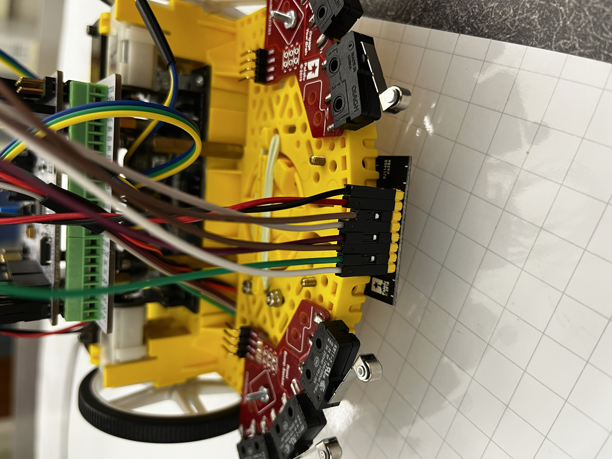
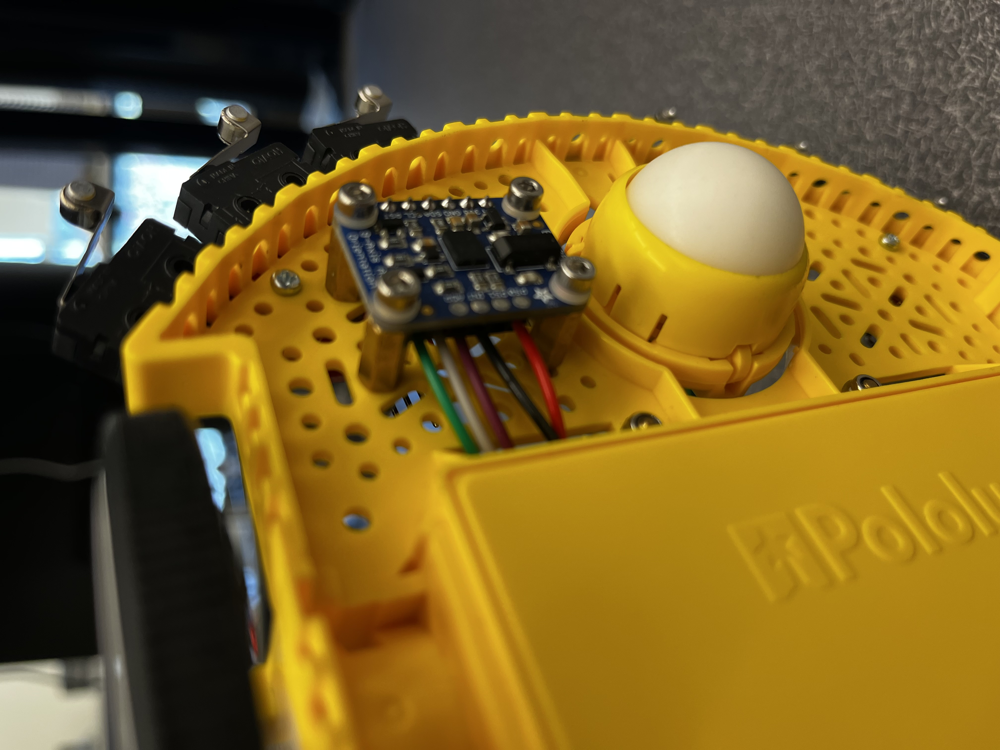
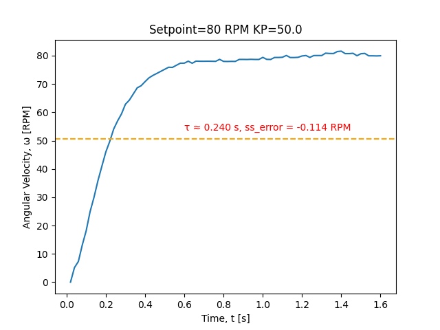
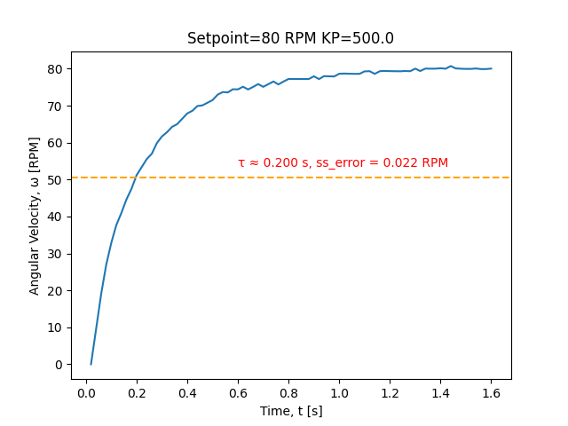
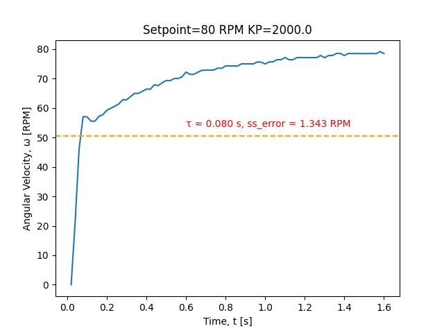

# ME405_MECHA31_ROMI

## Contributors

* Brian Ribbe
* Ben Backlin

## Overview and Competition Description

This project implements an autonomous robot, named ROMI, optimized to complete a competition racetrack in as little time as possible. For navigation, our ROMI was equipped with a line follower to track its position relative to a fixed line on the racetrack, a state observer to estimate its position and orientation, and a set of bump sensors for tactile feedback when making contact with obstacles. The software and hardware implementation of these features will be discussed within the following sections. 

The rules of the competition were kept relatively simple with the provided racetrack being split into 4 checkpoints and a finish position. These can be seen in the figure below. The first portion of the track was a straight line that required line-following up until checkpoint #1. Between checkpoint #1 and #2 was the "garage" section with a steel enclosure simulating a parking garage environment. There was no black line to follow for this section meaning all navigation had to be done without the line following feature. The only requirement for this section was that an element of sensing - either tactile with a bump sensor or with IR/ultrasonic proximity sensors - was used to detect the wall before responding. This meant that teams could not rely on their state observer for all of section 2. The section between checkpoints #2 and #3 was referred to as the "slalom" section and required line following to pass through obstacles. The next segment of the track was a simple turn into checkpoint #4, followed by a turn into the finish position. To count a checkpoint as "complete", ROMI had to completeley cover the checkpoint dot with its chassis.

Two optional objectives - represented by red cups - were present throughout the track. Completing each objective would reduce your time by 4 seconds. However, we determined the objectives to be of negligible value for the competition and instead focused on finishing the track as quickly as possible.


---

## Demo Video and Competition Results

The following videos document our three trial runs. For the competition, each team was allowed three attempts to finish. Completing the course three times demonstrated consistency and resulted in higher scoring. The best time of the three attempts was used for the final score. 

We are proud to say that our ROMI was not only one of the most consistent performers, but also the fastest in the entire competition. Whereas most teams took between 40 to 100 seconds to complete the course, our robot finished in 26.3 seconds. All three trials can be found on youtube and are linked below.

#### Trial 1 (26.9 seconds)
<p align="center">
  <a href="https://youtu.be/BLMAuTk7GWE">
    
  </a>
</p>

#### Trial 2 (26.3 seconds)
<p align="center">
  <a href="https://youtu.be/7kmqAkYPIVk">
    
  </a>
</p>

#### Trial 3 (26.6 seconds)
<p align="center">
  <a href="https://youtu.be/af3TSzDRKpg">
    
  </a>
</p>

## Hardware Design

This section will discuss our choice of components, mounting system, and wiring. No custom hardware was manufactured for this project.

### Components

#### Shoe of Brian and NUCLEO board

The Shoe of Brian is a custom I/O shield designed by Professor Ridgely that interfaces directly with the STM32 NUCLEO development board. The NUCLEO board houses the STM32 microcontroller, which is responsible for executing control algorithms, reading sensor data, and generating actuator commands.

#### QTR-MD-05A Reflectance Sensor Array:

For our line follower, a Polulu analog 5 sensor array was used. This sensor package uses IR LED/phototransistor pairs to illuminate the ground and detect reflectance. Originally, we used a QTR-HD-05A sensor array where the HD stands for high density. With only 5 sensors, we quickly found the high density package to be too narrow in focus for the track's line width. By changing to a medium density (MD) sensor with the same number of IR emitters, we were able to keep the same wiring and pin configurations while expanding our maximum sensable width by over 75%. This came at the expense of some fidelity between sensors, but this had a negligible effect on our line following.

Our wider, medium density, line follower can be seen centered on the front of our robot. Our bump sensors, discussed later, can also be seen on each side in red.

<p align="center">
  
</p>

#### TI DRV8838 Motor Drivers and Encoders:

Our ROMI chassis came equipped with two TI DRV8838 motor drivers. At no-load conditions, these motor drivers had a speed of 150 RPM at a nominal voltage of 4.5V. They also had a gear ratio of 120:1.

For reading displacement, these motor drivers also came with magnetic quadrature encoders that could read 12 counts per revolution. This resolution is extremely low, but with the gear ratio the true resolution is 1440 counts per revolution. For our use case, this resolution is adequate. 

#### Polulu Bump Sensor

Bump sensors are used for collision detection and provide a simple digital input indicating physical contact with obstacles.

#### BNO055 IMU

The BNO055 is a 9 degree of freedom IMU that combines an accelerometer, gyroscope, and magnotometer. It comes with its own MCU for sensor fusion, Euler angle processing, and calibration. This component, in addition to our encoders, was critical for developing our state observer. Special care had to be taken when finding the calibration coeffecients in order to ensure our IMU was properly calibrated. Additionally, we had to ensure the IMU was properly mounted so that any vibration due to the ROMI's motion had negligible effect on our output Euler angles.

### Mechanical Design and Mounting

All components were mounted using the provided M2 screws and matching hex nuts. For our IMU, two standoffs were used to ensure the IMU was parallel to the ground. We used another two standoffs for our refelctance line sensor. This enabled it to get closer to the ground for more precise readings. All standoffs were mounted using M2 screws. An image of our IMU mounted on its standoffs can be seen below. Two standoffs were leter removed for use on our line follower.

<p align="center">
  
</p>

### Wiring Diagram

The wiring that is consistent with our code is shown below, with red wires always representing power and black wires always representing ground. Each board shown is a picture of the exact same board that we used in our project, and the wiring is the exact same as what was used in our project, down to the wire colors!


---

##  Software Design

The software is modular and organized into the following components:

* **Drivers:** Classes that include the methods for each object that will be used in higher levels
  - **Ex:** 'encoder.py', 'motor_driver.py', 'observer.py'
* **Task Files:** Classes that represent each task that needs to run
  - **Ex:** 'task_motor.py', 'task_observer.py'
* **Libraries:** Files given to us by the instructor that set up inter-file communication and the scheduler
  - **Ex:** 'task_share.py', 'cotask.py'
* **Main:** The main file that initializes all the objects, shares, queues, and tasks
  - **Ex:** 'main.py'

### Task Diagram

Using this modular task structure we have seven tasks that communicate with each other using the shares and queues system. We use a task diagram to organize the scheduling and inter task communication between the tasks to ensure proper multitasking. 


### Task Structure

Our tasks are structured as generator functions so that they can keep internal state in between being called, which allows us to maintain proper multitasking. To plan out the structure of each task, we use finite state machines, one for each task. The diagrams show bubbles as states, with arrows as transitions labelled with the transition criteria and any variable changes as a result of the transition. Lastly, both the switch and debounce tasks are entirely based on interrupts and not structured as finite state machines in code, so they do not have corresponding diagrams that are shown below.

#### Motor Task
The motor tasks are identical, thus they are shown using the same finite state machine. The motor task includes eight states: Init, Wait, Run, Fllw, Estm, Turn, Turn Place, Straight. Init initializes the motors and moves to Wait where the task waits for the user to input a command. By choosing 'L' or 'R' the user activates a step response in the left or right motor respectively. By choosing 'F' the user activates the line following state, where Romi will follow a line indefinitely. By choosing 'E' Romi is set up to run exactly 1000 mm in a straight line controlled by the state estimator. Lastly, Turn, Turn Place and Straight are all results of the go command 'G' which starts Romi on the time trial track. The user interface task, 'task_user.py', controls the switching between the three aforementioned states based on the section of track.


#### User Task
The user task handles the user input and also recieves input from the state estimator to control Romi during the time trial. The task is broken down into 19 states, with state 0 being used for initialization and states 1-5 being used to handle and display user multicharacter inputs, recieved data from the line follower and step responses, and the wait state to allow for resets after certain commands. Lastly, states 6-18 all represent a section on the game track and control the different motor flags that dictate turning and moving straight. 


#### Line Follower and Observer Tasks
Both the line follower and observer tasks are structured in the same way, with only an initialization state and an idle state. The line follower runs every time it is called because the motor task only reads the values recieved by the line follower if a line following related command is called. Towards the end of the term we considered that the line follower always running may be eating time and causing tasks to run out of schedule, so we made it so that the line follow task passes if the followFlag is not high. Furthermore, the observer task needs to run always in order to maintain proper state estimation, so it is constantly taking readings.


## Motor Tuning and Parameterization

To tune the motor controller, a series of step response tests using Proportional-Integral Control (PI) were conducted with  a target setpoint of 80 RPM. The proportional gain (Kp) was varied while observing the resulting motor speed response using encoder feedback. Time constant, τ, and steady-state error were calculated in order to quantitatively compare responses. For each test, a KI value of 1500 was used.

Three representative cases were tested:

- **Kp = 50:**  
  The system response was slow with a time constant of 0.240 seconds. A small but noticeable steady state-error was present. This controller design was not aggressive enough for our needs.

- **Kp = 500:**  
  This gain produced the best overall performance. The system reached the setpoint quickly (τ = 0.20 seconds) with no overshoot and little to no steady-state error within our test time frame. The response was stable and aggressive enough for our needs

- **Kp = 2000:**  
  At high gain, the system became overly aggressive. The response exhibited significant oscillations and instability due to overcorrection, indicating that the controller was too sensitive to error.

Based on these results, a proportional gain of **Kp = 500** was selected as it provided the best balance between responsiveness and stability. This tuning process ensured reliable motor performance, which is critical for accurate line-following behavior.

<p align="center">
  
</p>

<p align="center">
  
</p>

<p align="center">
  
</p>

## Unique Features

## Challenges

Some challenges encountered during development included:

* Sensor noise and inconsistent readings
* Tuning control gains for stability
* Mechanical alignment of sensors

These issues were addressed through filtering, iterative tuning, and hardware adjustments.

---

## Future Improvements

* Implement more advanced control (e.g., adaptive or state-based control)
* Improve sensor calibration
* Increase speed while maintaining stability
* Enhance mechanical robustness

---

## Repository Structure

```
.
├── src/        # Python source code
├── hardware/   # Wiring diagrams and CAD files
├── images/     # Photos of the robot
├── docs/       # Diagrams and additional documentation
├── main.py     # Main execution file
└── README.md   # Project documentation
```


## Additional Notes

This project demonstrates the integration of sensing, control systems, and embedded programming to achieve autonomous behavior in a robotic platform.
