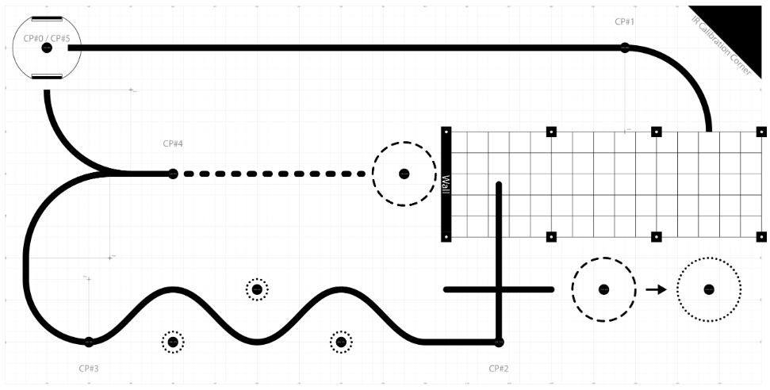

# ME405_MECHA31_ROMI

## Overview and Competition Description

This project implements an autonomous robot, named ROMI, optimized to complete a competition racetrack in as little time as possible. For navigation, our ROMI was equipped with a line follower to track its position relative to a fixed line on the racetrack, a state observer to estimate its position and orientation, and a set of bump sensors for tactile feedback when making contact with obstacles. The software and hardware implementation of these features will be discussed within the following sections. 

The rules of the competition were kept relatively simple with the provided racetrack being split into 4 checkpoints and a finish position. These can be seen in the figure below. The first portion of the track was a straight line that required line-following up until checkpoint #1. Between checkpoint #1 and #2 was the "garage" section with a steel enclosure simulating a parking garage environment. There was no black line to follow for this section meaning all navigation had to be done without the line following feature. The only requirement for this section was that an element of sensing - either tactile with a bump sensor or with IR/ultrasonic proximity sensors - was used to detect the wall before responding. This meant that teams could not rely on their state observer for all of section 2. The section between checkpoints #2 and #3 was referred to as the "slalom" section and required line following to pass through obstacles. The next segment of the track was a simple turn into checkpoint #4, followed by a turn into the finish position. To count a checkpoint as "complete", ROMI had to completeley cover the checkpoint dot with its chassis. 



The goal of this project was to design, build, and validate a complete electromechanical system integrating sensing, control, and actuation.

---

## Demo Video

[Watch the robot in action](PASTE_VIDEO_LINK_HERE)

## Hardware Design

### Components

* Reflectance sensor array (QTR)
* DC motors with encoders
* Motor driver
* Microcontroller (e.g., STM32 / Pyboard)

### Mechanical Design

Custom mounts were used to position the sensors and motors appropriately.

### Wiring Diagram


---

##  Software Design

The software is modular and organized into the following components:

* **Drivers:** Classes that include the methods for each object that will be used in higher levels
  - **Ex:** 'encoder.py', 'motor_driver.py', 'observer.py'
* **Task Files:** Classes that represent each task that needs to run
  - **Ex:** 'task_motor.py', 'task_observer.py'
* **Libraries:** Files given to us by the instructor that set up inter-file communication and the scheduler
  - **Ex:** 'task_share.py', 'cotask.py'
* **Main:** The main file that initializes all the objects, shares, queues, and tasks
  - **Ex:** 'main.py'

### Task Diagram

Using this modular task structure we have seven tasks that communicate with each other using the shares and queues system. We use a task diagram to organize the scheduling and inter task communication between the tasks to ensure proper multitasking.


### Task Structure

Our tasks are structured as generator functions so that they can keep internal state in between being called, which allows us to maintain proper multitasking. To plan out the structure of each task, we use finite state machines, one for each task. 

---

## 🧮 Control System

A feedback controller was implemented to minimize the error between the robot’s position and the line.

* **Error Definition:** Difference between desired line position and measured position
* **Control Method:** (e.g., PID / proportional / other)

Control equation:

```
u(t) = Kp * e(t) + Ki * ∫e(t)dt + Kd * de(t)/dt
```

Controller gains were tuned experimentally to achieve stable and responsive performance.

---

## 📊 Results

The robot successfully followed the line under normal operating conditions.

**Performance observations:**

* Stable tracking with minimal oscillation
* Responsive to changes in line curvature
* Maximum speed: (add value)

(Optional: include plots if available)


---

## ⚠️ Challenges

Some challenges encountered during development included:

* Sensor noise and inconsistent readings
* Tuning control gains for stability
* Mechanical alignment of sensors

These issues were addressed through filtering, iterative tuning, and hardware adjustments.

---

## 🔁 Future Improvements

* Implement more advanced control (e.g., adaptive or state-based control)
* Improve sensor calibration
* Increase speed while maintaining stability
* Enhance mechanical robustness

---

## 📂 Repository Structure

```
.
├── src/        # Python source code
├── hardware/   # Wiring diagrams and CAD files
├── images/     # Photos of the robot
├── docs/       # Diagrams and additional documentation
├── main.py     # Main execution file
└── README.md   # Project documentation
```

---

## 📸 Project Photos


---

## 👥 Contributors

* Your Name
* Teammate Name

---

## 📎 Additional Notes

This project demonstrates the integration of sensing, control systems, and embedded programming to achieve autonomous behavior in a robotic platform.
